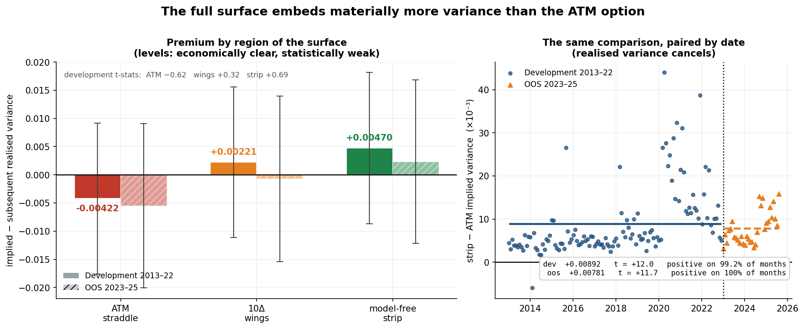
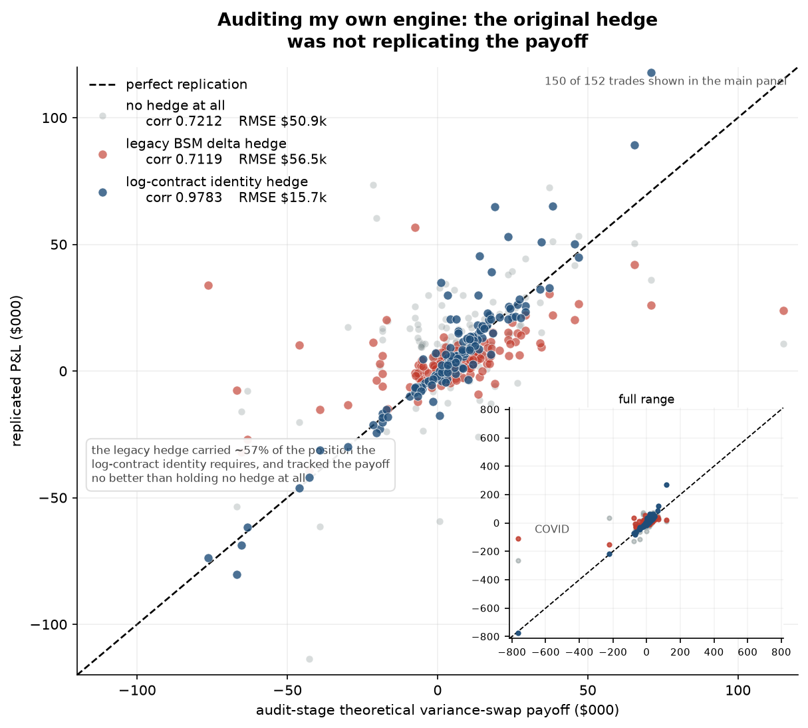
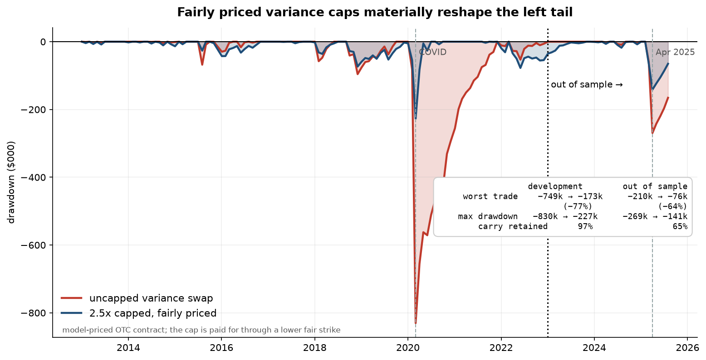
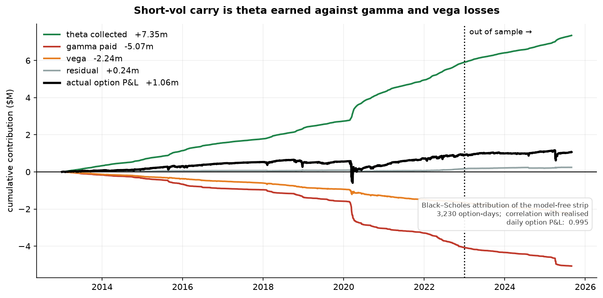
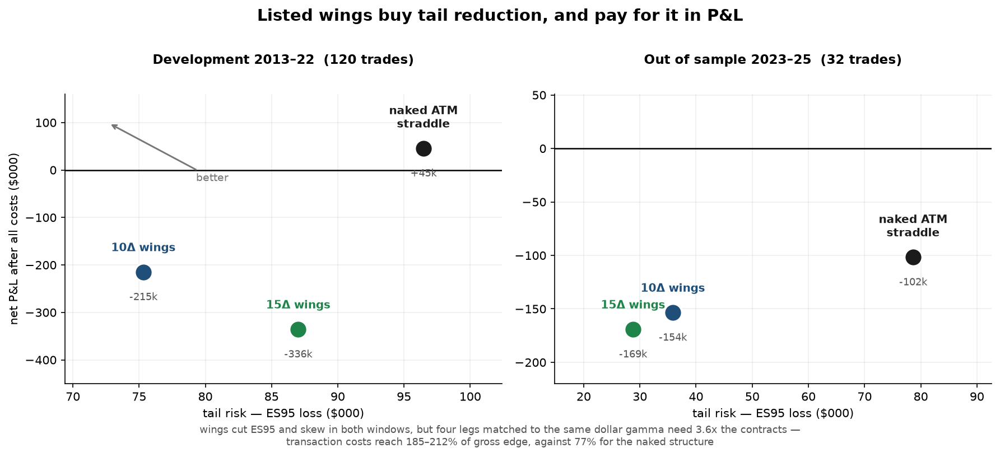

# Equity Options Volatility Research

[](https://github.com/kmnsg-0226/options-volatility-research/actions/workflows/ci.yml)

An execution-aware SPY options research framework spanning **Black–Scholes implied volatility and Greeks, model-free variance replication, stochastic-volatility calibration, Monte Carlo tail pricing, and listed-option trading**.

The project asks a simple question:

> **Can the equity-option volatility risk premium be harvested after correct replication, realistic execution, financing, and tail risk are accounted for?**

The main result is not a high-Sharpe trading rule.

Instead, the research finds that **ATM options and the full volatility surface price fundamentally different variance exposures**, shows how an initially attractive backtest was distorted by an incorrect hedge specification, and finds that explicitly pricing variance-tail protection improves the payoff distribution far more reliably than signal timing or listed-option wings.

All strategy results are reported split into **development (2013–2022)** and **out-of-sample (2023–2025)** windows. Strategy-selection experiments using the 2023–2025 holdout were frozen before evaluation where applicable; development and OOS results are reported separately throughout.

---

## How the project got here

It began as a conventional test of the at-the-money implied-versus-realised
volatility premium — a short ATM straddle, an HAR-RV forecast, and a VRP z-score.
**That signal proved weak.** Measured properly, the ATM premium in this sample is
*negative* (−0.0042, t = −0.62), which is why the original strategy never had a
reliable edge to harvest.

Establishing that led to the rest of the work: to model-free variance, which
prices the whole surface rather than one strike; then to an audit that found the
replication hedge was wrong; then to correct log-contract replication; and
finally to explicit tail pricing and a listed-options implementation.

The archived research summaries under
[`reports/archive/`](reports/archive/) preserve that progression, including the
phases whose conclusions were later overturned.

---

## Key results

### 1. The full surface embeds materially more variance than the ATM option

ATM implied variance does **not** show a statistically reliable positive premium on its own.

By contrast, integrating the full option surface produces systematically higher implied variance than the ATM measure.

The key result is the **paired wedge** between strike-integrated and ATM implied variance:

| | Development | OOS |
|---|---:|---:|
| Model-free − ATM variance | **+0.00892** | **+0.00781** |
| t-stat | **12.0** | **11.7** |
| Positive observations | **99.2%** | **100%** |

Because both measures are evaluated against the same subsequent realised variance, the realised component cancels in the paired difference.

The individual variance-premium estimates are much noisier — development t-statistics are −0.62 for ATM and +0.69 for the strip — so the robust finding is that the **full surface embeds materially more variance than the ATM option alone**.



This explains a result that appears repeatedly throughout the project:

> **A short ATM straddle and a short market-variance position are not the same volatility trade.**

---

### 2. Auditing the backtest changed the economic conclusion

An early replication engine hedged the static option strip by neutralising its aggregate Black–Scholes delta.

That produced an attractive-looking strategy.

It was also the wrong hedge for the derivative being studied.

The correct variance-replication hedge follows from the **log-contract identity**, not from neutralising the aggregate delta of the vanilla-option strip.

Comparing all three variants against the same audit-stage theoretical
variance-swap payoff ([`tracking_error.csv`](reports/variance_hedge_identity_audit/tracking_error.csv)):

| Replication engine | Correlation | RMSE |
|---|---:|---:|
| Legacy option-delta hedge | **0.7119** | **$56,493** |
| No hedge at all | **0.7212** | **$50,892** |
| Log-contract identity hedge | **0.9783** | **$15,723** |



The legacy hedge carried roughly **57%** of the position the identity requires, and tracked the theoretical payoff no better than holding no hedge at all.

The canonical engine also corrected:

- inconsistent contract and realised-variance horizons;
- missing financing on the dynamic hedge;
- hard-coded dividend yield assumptions;
- cash-account inconsistencies.

After those corrections, the rebuilt canonical engine reconciles as a
self-financing strategy and tracks the theoretical variance-swap payoff at
approximately **0.999 correlation** with **~$3.7k RMSE**
([`tracking_quality.csv`](reports/canonical_variance_engine/tracking_quality.csv)).
Those figures are measured on the rebuilt engine's own payoff definition and are
not directly comparable with the audit-stage table above.

The correction materially worsened the apparent strategy economics.

That was the point of the audit.

---

### 3. Canonical variance carry is positive, but violently skewed

After correcting the methodology, unconditional short variance remains profitable on average but extremely negatively skewed.

| | Development 2013–2022 | OOS 2023–2025 |
|---|---:|---:|
| Trades | 120 | 32 |
| **Net P&L** | **+$368,604** | **+$12,064** |
| Sharpe | 0.15 | 0.03 |
| t-stat | 0.46 | 0.05 |
| Max drawdown | $813,014 | $263,012 |
| Worst trade | −$732,061 | −$209,153 |
| ES95 | −$171,332 | −$131,506 |
| Skew | −8.72 | −4.69 |
| Costs | $117,783 | $20,795 |
| Financing | −$789 | **−$16,692** |

The variance premium is positive in both samples, but statistically weak.

The problem is therefore not simply absence of carry.

It is the distribution of that carry.

A small number of realised-variance explosions dominate the payoff: the worst single trade of the decade is roughly **twice** the ten-year development total.

---

### 4. Model-priced variance caps materially reshape the left tail

Rather than trying to predict crashes, I next asked whether the tail could be **priced explicitly**.

A capped realised-variance swap has payoff

$$N\left[K_{\text{cap}} - \min(RV, C)\right]$$

where the fair capped strike is

$$K_{\text{cap}} = K_{\text{var}} - \mathbb{E}^{Q}\left[(RV - C)^{+}\right]$$

The cap is therefore not free.

The tail concession is priced point-in-time using a calibrated **Heston stochastic-volatility model and Monte Carlo simulation**. The uncapped strike stays model-free, so the model prices only the tail term.

For the primary 2.5× cap:

| | Development | OOS |
|---|---:|---:|
| Uncapped theoretical P&L | +$564,513 | +$74,632 |
| **2.5× capped P&L** | **+$548,729** | **+$48,253** |
| Uncapped worst trade | −$748,599 | −$209,691 |
| **Capped worst trade** | **−$172,598** | **−$76,400** |
| Uncapped Max DD | $830,373 | $269,466 |
| **Capped Max DD** | **$227,134** | **$141,377** |
| Sharpe, uncapped | 0.22 | 0.19 |
| **Sharpe, capped** | **0.56** | **0.25** |

Development worst-loss exposure falls by approximately **77%** and peak drawdown by approximately **73%**, retaining **97%** of the payoff.

OOS worst-loss exposure falls by approximately **64%**, with peak drawdown reduced by approximately **48%**, retaining **65%** of the payoff.



Across 2013–2025 the model charged **$934,967** for the tail and the tail actually cost **$892,805** — a loss ratio of **0.955**.

The result is economically interesting but should be interpreted carefully.

This is a **model-priced OTC derivative**, not a directly replicated listed-options strategy.

The main limitations are:

- only seven cap-binding events across 152 observations;
- significant sensitivity to Heston vol-of-vol — a ±20% error moves development P&L by ±45%;
- no dealer spread or OTC margin model;
- short-dated SPY surfaces weakly identify some Heston parameters.

The capped result is therefore best viewed as evidence that **properly priced path-dependent tail protection materially improves the payoff shape**, not as a plug-and-play trading system.

---

### 5. Black–Scholes Greeks explain how the option carry is earned

Black–Scholes remains useful throughout the project for vanilla-option pricing, implied-volatility inversion, listed-option risk management and local P&L attribution.

For daily option P&L,

$$dV \approx \Delta\, dS + \tfrac{1}{2}\Gamma\,(dS)^{2} + \mathcal{V}\, d\sigma + \Theta\, dt$$

Across **3,078 non-expiry option-days**, this Greek approximation achieved:

- actual-vs-attributed P&L correlation: **0.995**
- explained daily P&L variance: **99.0%**

Cumulative contributions across the full sample were approximately:

| Component | P&L contribution |
|---|---:|
| **Theta** | **+$7.35m** |
| Gamma | **−$5.07m** |
| Vega | **−$2.24m** |



The empirical decomposition makes the short-volatility trade intuitive:

> **Theta is the recurring source of carry; Gamma and Vega reclaim most of it during volatile markets.**

The residual is not treated as zero: despite explaining 99% of daily variance, second-order Greeks leave a cumulative residual material relative to the final net result, and adding vanna and volga makes the fit **worse**, not better.

---

### 6. Listed-options implementation

I also tested whether the same volatility ideas could be converted into a directly executable listed-SPY strategy.

The implementation uses:

- ATM short straddles;
- 10-delta and 15-delta protective wings;
- Black–Scholes IV, Delta, Gamma, Vega and Theta;
- Vega-target position sizing;
- dollar-Gamma stress constraints;
- daily BSM delta hedging;
- self-financing accounting;
- bid/ask execution, commissions, hedge slippage and financing.

The Greek machinery behaved as intended:

- residual hedge delta: **0.00 shares** on every open day
- Greek attribution correlation: **0.995**
- dollar-Gamma limit binding on **96%** of entries

But the strategy economics did not.

| Strategy | Dev Net | OOS Net | Dev Worst | OOS Worst |
|---|---:|---:|---:|---:|
| Naked ATM | **+$45,412** | **−$101,775** | −$302,734 | −$135,024 |
| 10Δ wings | −$215,135 | −$153,551 | **−$106,305** | −$45,427 |
| 15Δ wings | −$335,866 | −$169,229 | −$133,223 | **−$28,872** |

Protective wings clearly improve the tail, but the protection is too expensive after transaction costs: matched to the same dollar gamma, four legs need **3.6× the contracts**, and costs reach **185–212% of gross edge** against 77% for the naked structure.

The underlying surface explains why:

- ATM variance premium: **−0.0042**
- 10-delta wing premium: **+0.0022**

The strategy therefore sells relatively cheap ATM volatility while buying relatively expensive wings.



---

## Why timing did not solve the problem

I tested a deliberately small set of causal risk and participation rules based on:

- implied variance;
- HAR/EWMA realised-volatility forecasts;
- expected variance premium;
- variance term structure;
- downside option-surface exposure;
- carry-to-risk ratios.

All six branches were rejected.

Several rules appeared attractive on the full development sample, but their improvement was concentrated in only two February–March 2020 trades.

| Rule | Full-development edge | Excluding two 2020 crisis entries |
|---|---:|---:|
| Inverse variance | +0.181 | **−0.394** |
| Term structure | +0.183 | **−0.001** |
| Deep downside | +0.240 | **−0.096** |

*(Sharpe edge over a control holding constant exposure at the same average size.)*

Across the twelve specifications tested, the expected maximum Sharpe under the null is **0.263** — the best observed was 0.386, with a deflated-Sharpe probability of 0.61.

The evidence suggests a fundamental difficulty:

> **The periods offering the largest apparent variance premium are often the same periods carrying the largest variance risk.**

Simple causal scaling therefore tends to remove both the tail and the premium.

---

## What the project finds

1. **ATM implied variance and market variance are different objects.**
   The integrated option surface contains a highly persistent variance wedge relative to ATM volatility.

2. **Correct replication matters more than a superficially attractive backtest.**
   The original hedge materially understated the true variance tail.

3. **The sample exhibits positive average integrated variance carry, but the estimate is statistically weak and dominated by tail risk.**

4. **Simple timing and scaling rules do not robustly separate the premium from its tail risk.**

5. **A model-priced 2.5× capped-variance structure produces the strongest tail-adjusted economics in the project**, although it introduces OTC implementation and stochastic-volatility model risk.

6. **Listed Black–Scholes/Greek-managed strategies reduce tail risk but do not generate an economically attractive OOS edge after realistic costs.**

The overall conclusion is therefore:

> **Positive average SPY variance carry is present in this sample, but it is difficult to harvest efficiently. The strongest improvement comes from explicitly pricing the path-dependent tail rather than attempting to time volatility shocks.**

---

## Research toolkit

**Pricing & derivatives**

`Black–Scholes` · `Implied Volatility` · `Delta/Gamma/Vega/Theta` · `Put–Call Parity` · `Model-Free Variance` · `Log Contracts` · `Variance Swaps` · `Heston` · `Monte Carlo`

**Empirical research**

`HAR-RV` · `EWMA` · `Walk-Forward Validation` · `OOS Testing` · `Newey–West Statistics` · `Bootstrap Inference` · `Multiple-Testing Controls`

**Trading & engineering**

`OptionMetrics` · `Point-in-Time Option Chains` · `Bid/Ask Execution` · `Dynamic Hedging` · `Self-Financing Cash Ledger` · `Financing` · `Integer Contracts` · `Transaction Costs`

---

## Where the work lives

| Stage | Report | What it established |
|---|---|---|
| Methodology audit | [`variance_hedge_identity_audit/`](reports/variance_hedge_identity_audit/) | the original delta hedge did not replicate the variance payoff |
| Canonical engine | [`canonical_variance_engine/`](reports/canonical_variance_engine/) | model-free strip, identity hedge, self-financing ledger, 0.999 tracking |
| Risk & timing | [`risk_timing_and_participation/`](reports/risk_timing_and_participation/) | twelve causal rules tested, all six branches closed |
| Capped variance & Greeks | [`capped_variance_and_greeks/`](reports/capped_variance_and_greeks/) | Heston calibration, Monte Carlo tail pricing, Greek attribution |
| Listed options | [`listed_options_strategy/`](reports/listed_options_strategy/) | delta-hedged, Greek-managed listed strategy |

Each phase directory retains the methodology, summaries and result artifacts
needed to support the findings above. Frozen specifications and pre-OOS memos are
retained where applicable. Selected summaries from superseded exploratory phases
are kept under [`reports/archive/`](reports/archive/) for provenance.

Core modules:

```
src/equity_options_research/
  pricing/     black_scholes · greeks · implied_vol · bounds
               heston · heston_calibration · capped_variance
  research/    variance_identity        the log-contract identity (one definition)
               model_free_variance      dK/K² strip and fair variance strike
               canonical_variance_engine  replication, hedging, self-financing ledger
               greek_attribution        Black–Scholes P&L decomposition
               listed_vol_strategy      delta-hedged listed option book
               risk_timing              causal exposure rules
               final_test_guard         out-of-sample lock
  backtest/    wrds_eod · ingestion_config     raw WRDS → research panel
  data/        wrds_optionmetrics · wrds_security_prices · zero_curve
  execution/   option_fill · costs
  volatility/  range_based                     Garman–Klass realised variance
```

Longer technical notes — pricing conventions, ingestion, and the distinction
between Black–Scholes and model-free variance — are in
[`docs/README_technical_reference.md`](docs/README_technical_reference.md).

The five figures above are retained as publication artifacts. Figures 01, 02
and 05 can be rebuilt from tracked outputs; figures 03 and 04 were generated from
per-trade and per-option intermediate results that are intentionally not
committed because of repository-size and vendor-data constraints.

---

## Validation

The codebase contains **252 passing tests** covering pricing, Greeks, model-free
variance, replication identities, Heston pricing, Monte Carlo, cash-account
reconciliation, transaction costs, strategy freezing and OOS isolation.

```bash
python -m venv .venv && source .venv/bin/activate
python -m pip install -e '.[dev]'

pytest              # 252 tests
ruff check src tests
mypy src/equity_options_research
```

Python 3.11 or newer.

## Data

Option data is **OptionMetrics via WRDS** (SPY, 2010–2025), used point-in-time
with same-date rates and put-call-parity forwards. Raw vendor data is not
committed to this repository.

The test suite is self-contained and does not require proprietary data;
reproducing the empirical 2013–2025 results requires access to the underlying
OptionMetrics dataset.

## Known limitations

- SPY only, with 152 monthly observations; a small number of extreme episodes,
  particularly March 2020 and April 2025, drive much of the tail-risk evidence.
- Black–Scholes does not capture early exercise; American assignment on short
  in-the-money legs is not modelled.
- Capital is reported against a historical drawdown proxy and a $1M reference
  notional. **Broker or clearing margin is not modelled.**
- End-of-day quotes carry no depth or market impact, so capacity is not
  established.
- The capped variance swap is a model price for an OTC contract, with no dealer
  spread included.
